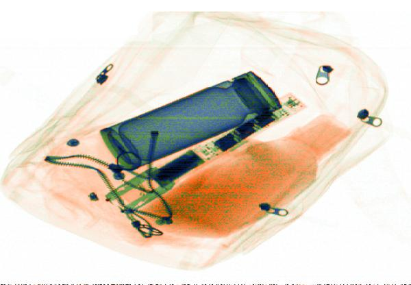
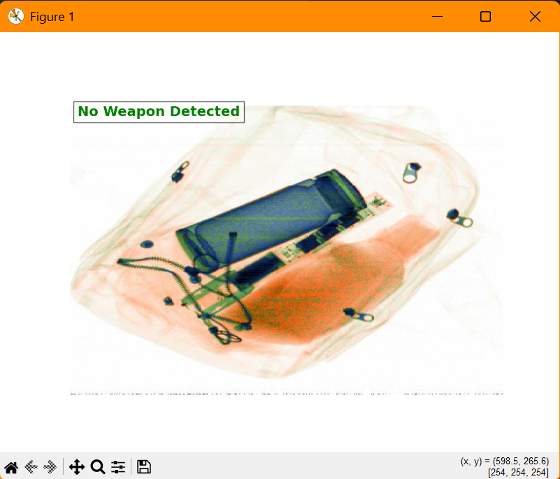
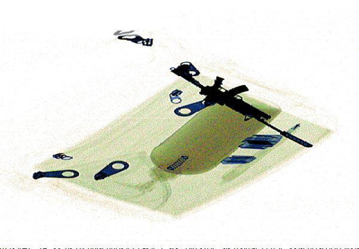
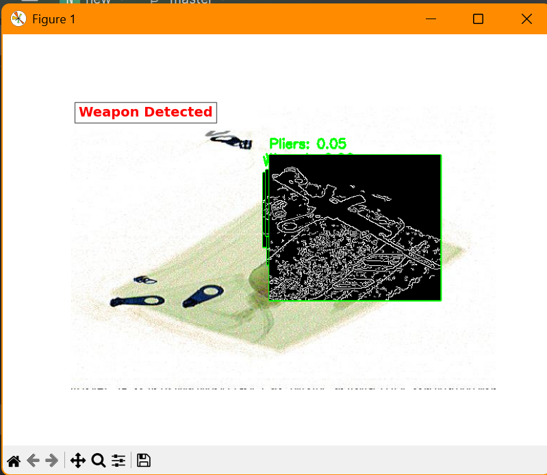
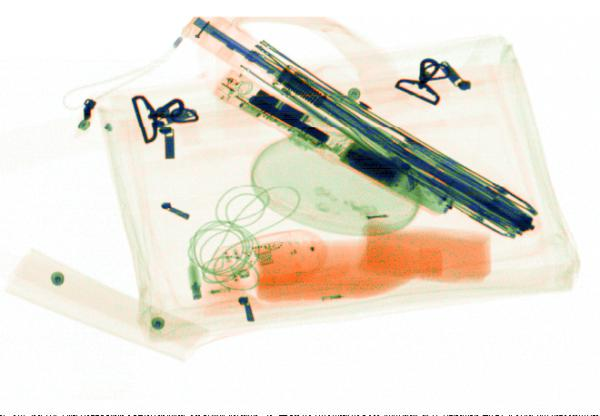
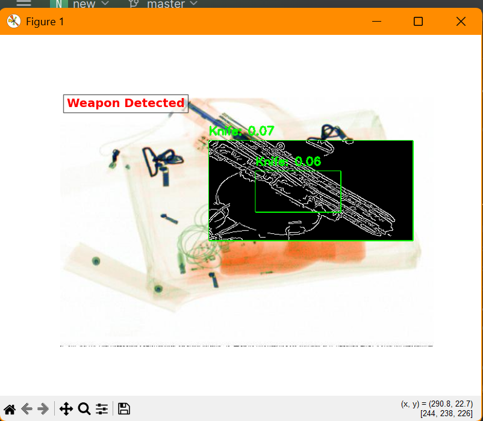
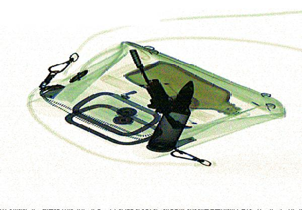
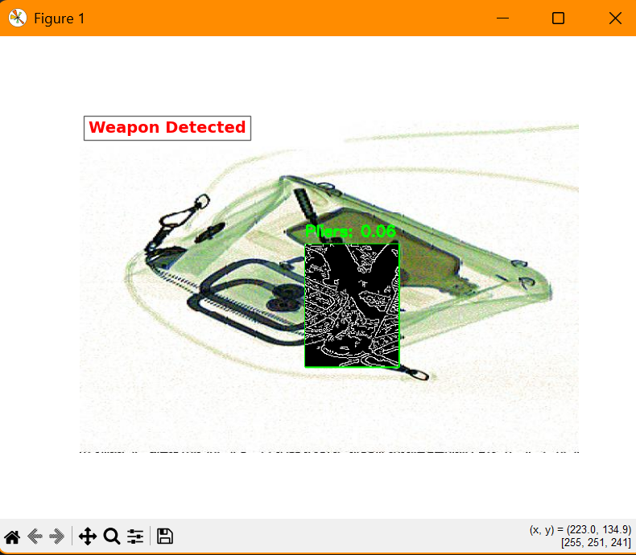

# 🛡️ Security Weapon Detector – AI-Powered X-Ray Threat Scanner


***🎯 "Smart Surveillance Starts Here."***
**A real-time AI tool that scans X-ray images and flags concealed weapons or threats using deep learning. Ideal for smart security systems at airports, checkpoints, and sensitive zones.**

---

## 🔍 What It Does
🧠 Weapon Detection from X-Ray Images

🚨 Real-Time Threat Alerts via Streamlit

🖼️ Visual Bounding Boxes on Threat Items

🛂 High Accuracy CNN Classifier Trained on Open X-ray Datasets

📤 Upload and Detect in Seconds

---

## 📸 How It Works
User uploads an X-ray baggage image.

AI model scans the image using a trained CNN (YOLO/ResNet/Custom).

Detected items (e.g., guns, knives) are highlighted on the image.

A threat label + confidence score is shown in the Streamlit interface.

---

## 🛠️ Tech Stack
Component	Tech Used
UI	Streamlit
Model	TensorFlow/Keras (CNN)
Processing	OpenCV, Pillow
Data Handling	NumPy, Pandas
Dataset	GDXray, OPIXray, Synthetic

---

## Download the model:

[Click here to download model](https://drive.google.com/file/d/17Wz53_fRefhsXR-Qu5ihvUa3x-yCu3rq/view?usp=sharing)

Place best.pt in the project root folder.

---
## 🚀 Getting Started
```bash
# Clone the repository
git clone https://github.com/n-bharath-chowdary/Security-Weapon-Detector.git
cd Security-Weapon-Detector

# Set up a virtual environment
python -m venv venv
source venv/bin/activate  # or venv\Scripts\activate on Windows

# Install dependencies
pip install -r requirements.txt

# Run the python app
python app.py
```
---

## 🧪 Use Cases
✈️ Airport security & baggage screening

🎫 Event security checkpoints

🏢 Smart building surveillance

🚔 Law enforcement digital forensics

---

## 🖼️ Sample Output

| Input | Output  |
|------------|-----------|
|  |  |
|  |  |
|  |  |
|  |  |

---
## 📚 Dataset Info
This project was trained on publicly available or synthetically generated X-ray image datasets like:

GDXray Dataset

OPIXray

---

## 📢 Contribute

Got ideas? Found a bug?
Open an Issue or submit a Pull Request – all contributions are welcome!


---

## 📄 License

This project is licensed under the MIT License. See the LICENSE file for details.


---

## 💬 Connect

## 🙋‍♂️ Author
#### Bharath Chowdary
##### [GitHub](https://github.com/n-bharath-chowdary) 
##### [LinkedIn](https://www.linkedin.com/in/n-bharath-chowdary/)
---
